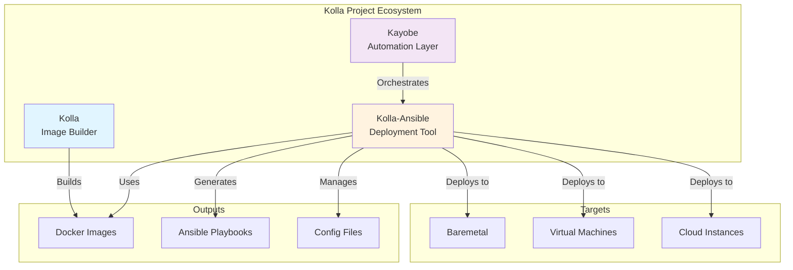
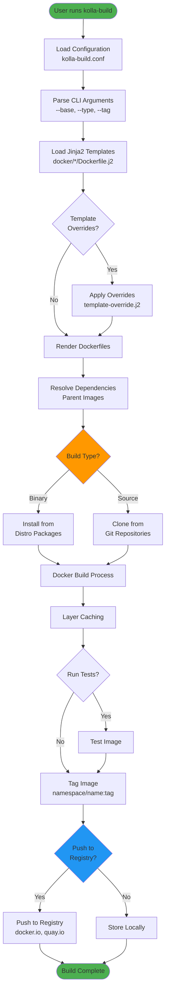
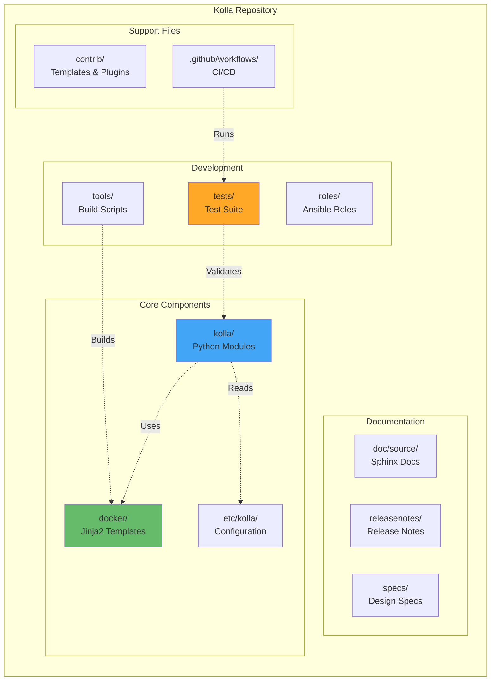
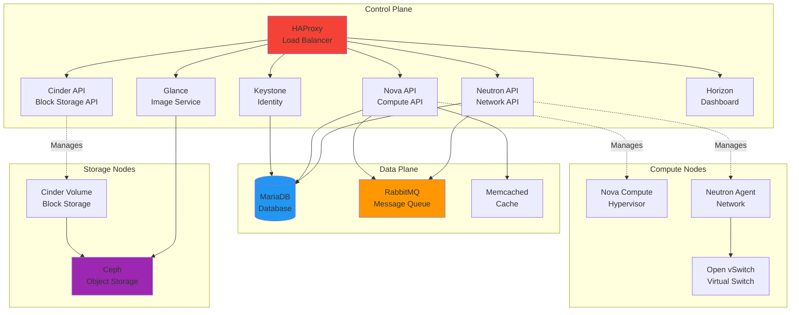
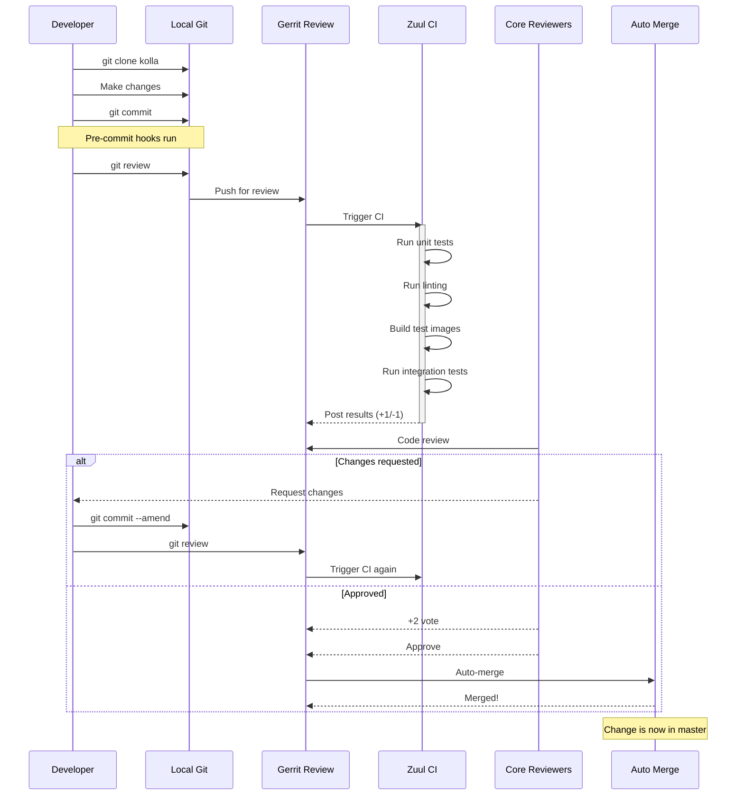
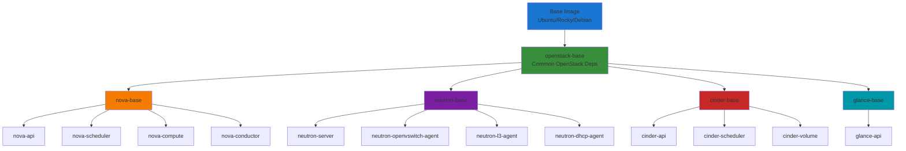
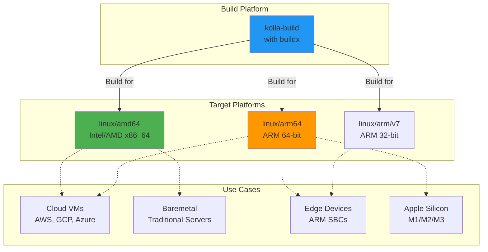
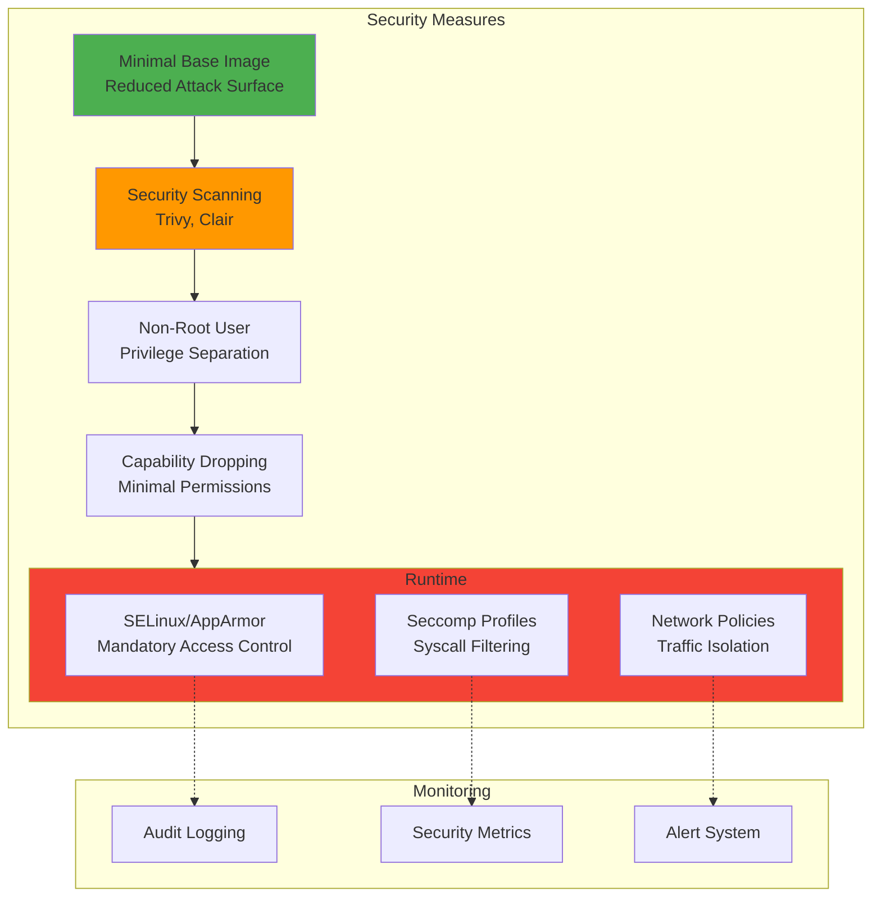
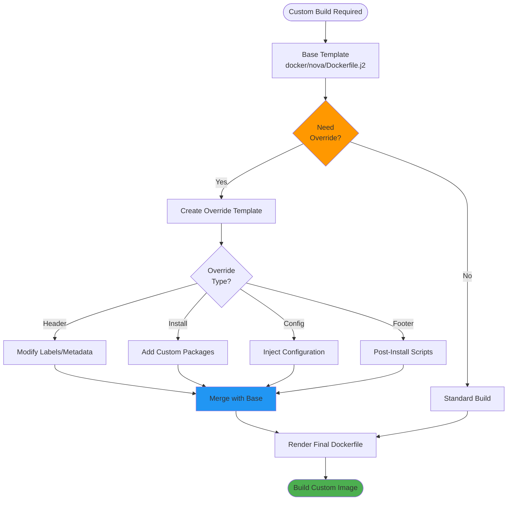

# Kolla Architecture Diagrams

This document contains visual diagrams to help understand Kolla's architecture and workflows.

---

## Table of Contents

- [Project Overview](#project-overview)
- [Image Build Flow](#image-build-flow)
- [Project Structure](#project-structure)
- [Deployment Architecture](#deployment-architecture)
- [Development Workflow](#development-workflow)

---

## Project Overview



**Description:**

- **Kolla**: Builds Docker images for OpenStack services
- **Kolla-Ansible**: Deploys those images using Ansible
- **Kayobe**: Provides higher-level automation on top of Kolla-Ansible

---

## Image Build Flow



**Build Process Stages:**

1. Configuration loading and CLI parsing
2. Jinja2 template processing with optional overrides
3. Dependency resolution (parent images)
4. Binary or source-based installation
5. Docker layer building with caching
6. Image tagging and optional registry push

---

## Project Structure



**Directory Structure:**

- **kolla/**: Core Python code for image building

  - `cmd/`: Command-line interface
  - `image/`: Image building logic
  - `template/`: Template processing
  - `common/`: Shared utilities

- **docker/**: Service-specific Dockerfile templates

  - One directory per OpenStack service
  - Hierarchical parent-child relationships

- **etc/kolla/**: Configuration files

  - Default configurations
  - Example templates

- **tests/**: Testing infrastructure
  - Unit tests
  - Functional tests
  - Integration tests

---

## Deployment Architecture



**Architecture Layers:**

1. **Control Plane**: API services, dashboard, identity
2. **Data Plane**: Database, message queue, caching
3. **Compute Nodes**: Hypervisors and networking agents
4. **Storage Nodes**: Block and object storage

---

## Development Workflow



**Workflow Steps:**

1. **Clone & Setup**: Clone repository and setup git-review
2. **Develop**: Make changes, write tests, update docs
3. **Commit**: Create commit with proper message format
4. **Review**: Submit to Gerrit with `git review`
5. **CI**: Zuul runs automated tests
6. **Code Review**: Core reviewers provide feedback
7. **Iterate**: Address feedback and resubmit
8. **Merge**: After approval, change is auto-merged

---

## Image Hierarchy



**Image Hierarchy Benefits:**

- **Efficient Builds**: Shared layers reduce build time
- **Consistency**: All services share common dependencies
- **Maintainability**: Changes to base propagate to children
- **Storage**: Docker layer caching minimizes storage

---

## CI/CD Pipeline

```mermaid
flowchart LR
    subgraph "GitHub Actions"
        direction TB

        PR[Pull Request/Push] --> Tests[Tests Workflow]
        PR --> Lint[Linting Workflow]
        PR --> Security[Security Workflow]
        PR --> Docs[Docs Workflow]

        Tests --> UT[Unit Tests<br/>py3.8-3.12]
        Tests --> Coverage[Coverage Report<br/>80% minimum]

        Lint --> Ruff[Ruff Linter]
        Lint --> Bandit[Bandit Security]
        Lint --> Yamllint[YAML Lint]
        Lint --> Ansible[Ansible Lint]

        Security --> Safety[Safety Check]
        Security --> Trivy[Trivy Scan]
        Security --> CodeQL[CodeQL Analysis]

        Docs --> Sphinx[Sphinx Build]
        Docs --> Links[Link Check]
    end

    subgraph "Zuul CI"
        direction TB

        ZPR[Gerrit Review] --> ZTests[Test Suite]
        ZTests --> ZBuild[Image Builds]
        ZBuild --> ZDeploy[Test Deployment]
        ZDeploy --> ZValidate[Validation]
    end

    subgraph "Release"
        Tag[Git Tag] --> Release[Release Workflow]
        Release --> Notes[Generate Release Notes]
        Release --> Publish[Publish to Registries]
        Publish --> DockerHub[Docker Hub]
        Publish --> Quay[Quay.io]
    end

    style Tests fill:#4caf50
    style Lint fill:#ff9800
    style Security fill:#f44336
    style Release fill:#2196f3
```

**CI/CD Stages:**

1. **Continuous Integration**: Automated testing on every change
2. **Security Scanning**: Vulnerability detection and compliance
3. **Documentation**: Automated doc builds and validation
4. **Release**: Automated image publishing and release notes

---

## Multi-Architecture Support



**Multi-Architecture Benefits:**

- **AMD64**: Traditional x86_64 servers and cloud instances
- **ARM64**: Modern ARM processors (Apple Silicon, AWS Graviton)
- **ARMv7**: Edge computing and IoT devices
- **Flexibility**: Deploy on diverse hardware platforms

---

## Container Security Layers



---

## Template Override System



**Override Example:**

```jinja2
{# template-override.j2 #}



# Install custom driver
RUN pip install custom-virt-driver

# Add configuration
COPY custom-nova.conf /etc/nova/nova.conf.d/

```

---

## Useful Links

- 📖 **Documentation**: https://docs.openstack.org/kolla/latest/
- ❓ **FAQ**: [FAQ.md](FAQ.md)
- 📝 **Contributing**: [CONTRIBUTING.rst](CONTRIBUTING.rst)
- 📋 **Changelog**: [CHANGELOG.md](CHANGELOG.md)

---

**Note**: These diagrams use [Mermaid](https://mermaid.js.org/) syntax and can be rendered in:

- GitHub (native support)
- GitLab (native support)
- VS Code (with Mermaid extension)
- Documentation sites (Sphinx with mermaid extension)
